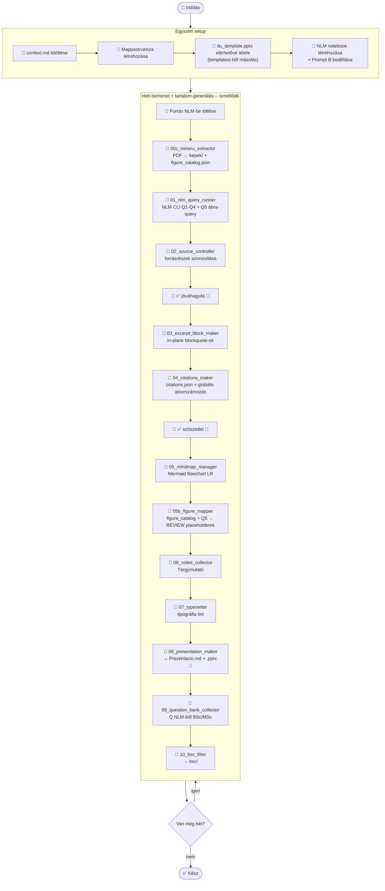

# PIPELINE.MD -- NLM Pipeline

# 1. Vizualizáció

# 2. IO táblázat

| Lépés | Input | Output | Felelős |
|-------|-------|--------|---------|
| 00_references_collector | User PDF-ek, Deep Research | forrasok/*.pdf + citations_seed.json | 🤖+👤 |
| 00b_nlm_notebook_setup | sources | NLM notebook + Prompt B + UUID-k | 🔌 |
| 00c_mineru_extractor | forrasok/*.pdf | kepek/ + figure_catalog.json | 🐍 |
| 01_nlm_query_runner | NLM notebook + mindmap | nlm_q*_raw.txt (Q5=ábra) | 🔌 |
| 02_source_controller | nlm_q*_raw.txt | (belső) | 🤖 🛑 |
| 03_excerpt_block_maker | N_Jegyzet.md draft | N_Jegyzet.md (in-place, blockquote-ok) | 🤖 |
| 04_citations_maker | citations_seed.json + raw txt | N_Szozedet.md + citations.json | 🤖 🛑 |
| 05_mindmap_manager | mindmap_raw.md | N_Mindmap.md | 🤖 |
| 05b_figure_mapper | figure_catalog.json + nlm_q5_raw.txt | N_Jegyzet.md (FIG REVIEW blokkok) | 🤖 |
| 06_notes_collector | N_Jegyzet.md | N_Jegyzet.md (in-place, Tárgymutató) | 🤖 |
| 07_typesetter | N_Jegyzet.md | N_Jegyzet.md (in-place, lint) | 🤖 |
| 08_presentation_maker | N_Jegyzet.md + template | N_Prezentacio.md + .pptx | 🤖+🐍 |
| 09_question_bank_collector | NLM notebook | N_Kerdesek.md (SZINT:2-5) | 🔌+🤖 |
| 10_bsc_filter | N_*.md | bsc/ (MSc blokkok nélkül) | 🐍 |

# 3. Forrástípusok

- Tiszta/scannelt PDF (képpel, táblázattal, egyenlettel)
- MS Office: Word, PowerPoint vagy ezek PDF változatai
- Webes forrás: HTML, YouTube

⚠️ **Képes PDF kétlépcsős eljárás:** MinerU 🐍 markdown-t és képeket külön fájlként
kell NLM-be tölteni. Alt-text kötelező a jó RAG-eredményhez.
Részletek: [kepek_workflow.md](kepek_workflow.md)

# 4. Utasítás szintek

**NLM utasítások** (Configure Chat, notebook-szintű, max 10 000 karakter)
- Szerepkör, citáció, ábrahivatkozás, kimeneti formátum
- Sablon: [nlm_prompts.md](nlm_prompts.md) Prompt B

**Claude utasítások** (Cowork Instructions + CLAUDE.md)
- Session protokoll, checkpoint logika, dokumentálási szabályok

# 5. Checkpointok

| Checkpoint | Feltétel | Claude viselkedése |
|------------|----------|--------------------|
| Egyszeri setup | du_template.pptx + NLM Prompt B | Folytatja |
| Heti bemenet | NLM queryok megérkeztek | 01_nlm_query_runner indul |
| 02_source_controller után | 👤 jóváhagyva | 03_excerpt_block_maker indul |
| 04_citations_maker után | 👤 jóváhagyva | 05_mindmap_manager indul |
| Bármelyik hiányzik | -- | Leáll, jelzi mi hiányzik |

# 6. Heti outputok

| Fájl | Lépés |
|------|-------|
| forrasok/nlm_q*_raw.txt | 01_nlm_query_runner |
| forrasok/figure_catalog.json | 00c_mineru_extractor |
| N_Szozedet.md | 04_citations_maker |
| N_Mindmap.md | 05_mindmap_manager |
| N_Jegyzet.md | 06 + 07_typesetter |
| N_Prezentacio.md + .pptx 🐍 | 08_presentation_maker |
| N_Kerdesek.md | 09_question_bank_collector |
| bsc/ 🐍 | 10_bsc_filter |

# 7. MCP / automatizálás

Az aktív megoldás: `notebooklm-mcp-cli` (Python CLI) Windows-MCP PowerShell hídon.
Részletek és notebook-lista: [nlm_integration.md](nlm_integration.md)

# Változásjegyzék

| Dátum | Verzió | Leírás |
|-------|--------|--------|
| 2026-05-21 | 1.0 | Létrehozva, NLM-only pipeline |
| 2026-05-21 | 1.1 | Linkjavítás, 03 in-place pontosítva |
| 2026-05-23 | 2.0 | "elavult" eltávolítva; 01_nlm_query_runner + 00c + 05b beillesztve; IO táblázat hozzáadva; pipeline_next_steps.md strukturális javaslatai beépítve |
