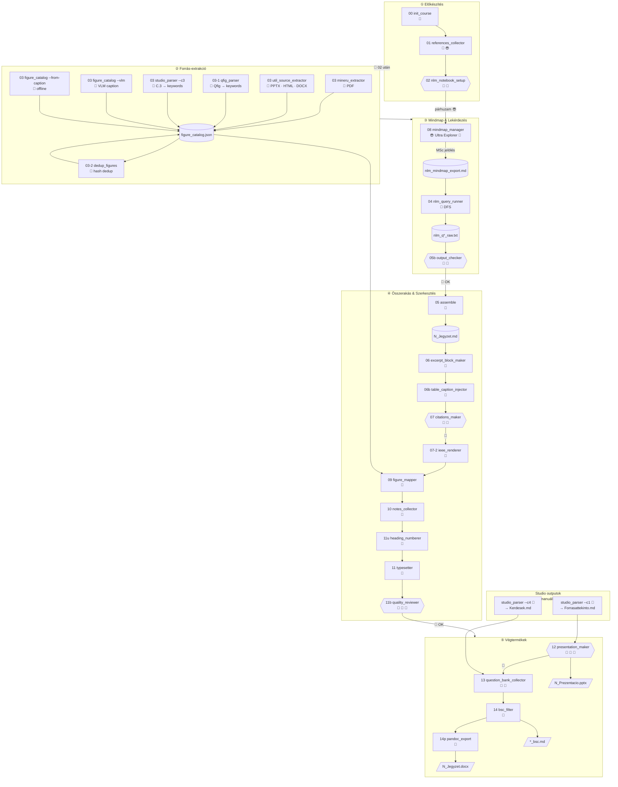

# PIPELINE.MD -- NLM Pipeline

# 1. Lépések és IO

| Input | Input/<br>felelős | Lépés | Automatizáltság/<br>Checkpoint | Output |
|:------|:--------------|:------|:-----------------------------|:-------|
| Tantárgynév + hetek | 😎 | `scripts/00_init_course.py --subject <név> --weeks N` -- struktúra + context.md a sablonból | 🐍 | `test_outputs/<Tantargy>/context.md` + `N_het/{1..5}_*/` |
| User PDF-ek, URL-ek | 😎 | [01_references_collector](skills/01_references_collector.md) | 🤖+😎 | `1_raw_inputs/` + `citations_seed.json` |
| `1_raw_inputs/` | 🤖+😎 | [02_nlm_notebook_setup](skills/02_nlm_notebook_setup.md) | 🔌 🚦 | NLM notebook + [Prompt B](nlm_prompts.md#2-prompt-b--notebooklm-custom-instructions) + UUID-k |
| `1_raw_inputs/*.pdf` | 😎 | [03_mineru_extractor](skills/03_mineru_extractor.md) | 🐍 | `2_clean_inputs/<forrasnev>/auto/` + `3_raw_outputs/figure_catalog.json` |
| NLM notebook | 🔌 | `scripts/03-1_qfig_parser.py` -- Qfig CLI query → caption + keywords | 🐍 | `3_raw_outputs/figure_catalog.json` (caption + keywords) |
| [Prompt C.3](prompts/prompt_c3_abrajegyzek.md) Studio output | 😎 | `scripts/03_util_studio_parser.py --c3` -- C.3 táblázat → keywords | 🐍 | `3_raw_outputs/figure_catalog.json` (NLM keywords, **ajánlott fallback**) |
| `2_clean_inputs/` | 🐍 | `scripts/03_util_figure_catalog.py --vlm` -- VLM caption+keywords | 🐍 | `3_raw_outputs/figure_catalog.json` (`vlm_done=True`) |
| `2_clean_inputs/` | 🐍 | `scripts/03_util_figure_catalog.py --from-caption` -- caption→keywords (offline) | 🐍 | `3_raw_outputs/figure_catalog.json` (caption-alapú keywords) |
| `3_raw_outputs/figure_catalog.json` | 🐍 | `scripts/03-2_dedup_figures.py` -- hash-alapú dedup | 🐍 | `3_raw_outputs/figure_catalog.json` (`duplicate` flag) |
| NLM notebook (Studio) | 😎 | [08_mindmap_manager](skills/08_mindmap_manager.md) -- Ultra Explorer export + **MSc jelölés** | 😎 🚦 | `3_raw_outputs/nlm_mindmap_export.md` (átnevezve!) |
| `3_raw_outputs/nlm_mindmap_export.md` | 🔌 | [04_nlm_query_runner](skills/04_nlm_query_runner.md) -- DFS lekérdezések | 🔌 | `3_raw_outputs/nlm_q{N}_raw.txt` + `3_raw_outputs/nlm_qfig_raw.txt` |
| `3_raw_outputs/nlm_q*.txt` | 🤖 | [05b_nlm_output_checker](skills/05b_nlm_output_checker.md) -- minőségellenőrzés | 🤖 🚦 | (belső checkpoint) |
| `3_raw_outputs/nlm_q*.txt` | 🐍 | `scripts/05_assemble.py` -- DFS outputok összefűzése | 🐍 | `4_wip_outputs/N_Jegyzet.md` (draft) |
| `4_wip_outputs/N_Jegyzet.md` draft | 🐍 | [06_excerpt_block_maker](skills/06_excerpt_block_maker.md) -- `06_excerpt_block_maker.py --mode extractive` | 🐍 | `4_wip_outputs/N_Jegyzet.md` (💡/🗺️ blockquote-ok) |
| `4_wip_outputs/N_Jegyzet.md` | 🐍 | [06b_table_caption_injector](skills/06b_table_caption_injector.md) -- `06_table_caption_injector.py <fajl>` (⚠️ direkt fájl arg, nem --week-dir) | 🐍 | `4_wip_outputs/N_Jegyzet.md` (táblázat captionök) |
| `citations_seed.json` + `3_raw_outputs/` | 🤖 | [07_citations_maker](skills/07_citations_maker.md) | 🤖 🚦 | `4_wip_outputs/N_Szozedet.md` + `3_raw_outputs/citations.json` |
| `3_raw_outputs/citations.json` + `4_wip_outputs/N_Jegyzet.md` | 🐍 | `scripts/07-2_ieee_renderer.py --week-dir <mappa>` -- IEEE hivatkozásjegyzék renderelése | 🐍 | `4_wip_outputs/N_Jegyzet.md` (IEEE `## Hivatkozásjegyzék`) |
| [Prompt C.1](prompts/prompt_c1_forrasattekinto.md) Studio output | 😎 | `scripts/03_util_studio_parser.py --c1` | 🐍 | `4_wip_outputs/N_Forrasattekinto.md` |
| [Prompt C.4](prompts/prompt_c4_kerdesbank_alap.md) Studio output | 😎 | `scripts/03_util_studio_parser.py --c4` | 🐍 | `4_wip_outputs/N_Kerdesek.md` |
| `3_raw_outputs/figure_catalog.json` + `3_raw_outputs/` | 🐍 | [09_figure_mapper](skills/09_figure_mapper.md) | 🤖 | `4_wip_outputs/N_Jegyzet.md` (FIG blokkok) |
| `4_wip_outputs/N_Jegyzet.md` | 🤖 | [10_notes_collector](skills/10_notes_collector.md) | 🤖 | `4_wip_outputs/N_Jegyzet.md` (Tartalomjegyzék) |
| `4_wip_outputs/N_Jegyzet.md` | 🐍 | `scripts/11_util_heading_numberer.py` | 🐍 | `4_wip_outputs/N_Jegyzet.md` (sorszámozott fejlécek) |
| `4_wip_outputs/N_Jegyzet.md` | 🤖 | [11_typesetter](skills/11_typesetter.md) | 🤖 | `4_wip_outputs/N_Jegyzet.md` (lint + próza) |
| `4_wip_outputs/N_Jegyzet.md` | 🐍+🤖 | [11b_quality_reviewer](skills/11b_quality_reviewer.md) -- `11b_quality_check.py` (metrikák) + Explore review | 🐍+🤖 🚦 | (belső checkpoint + `4_wip_outputs/N_Review.md`) |
| `4_wip_outputs/N_Jegyzet.md` + template | 🤖 | [12_presentation_maker](skills/12_presentation_maker.md) | 🤖+🐍 | `4_wip_outputs/N_Prezentacio.md` → `5_clean_outputs/N_Prezentacio.pptx` |
| NLM notebook (mindmap-vez.) | 🔌 | [13_question_bank_collector](skills/13_question_bank_collector.md) | 🔌+🤖 | `4_wip_outputs/N_Kerdesek.md` |
| `4_wip_outputs/N_*.md` | 🤖 | [14_bsc_filter](skills/14_bsc_filter.md) | 🐍 | `5_clean_outputs/*_bsc.md` |
| `4_wip_outputs/N_Jegyzet.md` v. `5_clean_outputs/*_bsc.md` | 🐍 | `scripts/14_util_pandoc_export.py` -- camera-ready DOCX (Pandoc + template) | 🐍 | `5_clean_outputs/N_Jegyzet[_bsc].docx` |

💡 **Egy NLM notebook = egy hét anyaga.** Prompt B és forrás-UUID-ek per-hét izoláltak.

**NLM promptok:** [nlm_prompts.md](nlm_prompts.md)
- [Prompt B](prompts/prompt_b_nlm_custom_instructions.md) (NLM Configure Chat), [Prompt C](prompts/prompt_c_datatables.md) (Data Tables Studio: [C.1](prompts/prompt_c1_forrasattekinto.md) / [C.2](prompts/prompt_c2_fogalomterkep.md) / [C.3 képpipeline](prompts/prompt_c3_abrajegyzek.md) / [C.4](prompts/prompt_c4_kerdesbank_alap.md)), [Prompt D](prompts/prompt_d_szozedet.md), [Prompt E](prompts/prompt_e_kerdesbank.md).

💡 **Helyes végrehajtási sorrend:** `02 → 03 → 03-1 → 03-vlm → 03-2 → 08 (mindmap export + MSc jelölés!) → 04 (DFS + --qfig) → 05b (check) → 05_assemble → 06 → 06b → 07 → **07-2 (IEEE renderer)** → 09 → 10 → 11 → **11b (quality review)** → 12 → 13 → 14`

💡 **Qfig (ábra-query, ingyenes VLM alternatíva):** `python scripts/04_nlm_dfs_queries.py --week-dir ... --qfig` → `nlm_qfig_raw.txt` → `03-1_qfig_parser.py` → `figure_catalog.json keywords`. Futtatandó a DFS után, 09_figure_mapper előtt.

⚠️ **08 (mindmap export) kötelezően megelőzi a 04-et**: a `04_nlm_dfs_queries.py` a `nlm_mindmap_export.md` fájlt olvassa. Ha a mindmap nem exportált, a DFS nem indul.

⚠️ **MSc jelölés**: mindmap export UTÁN, DFS (04) ELŐTT: a user `[MSc]` előtaggal jelöli az MSc-szintű csomópontokat az `nlm_mindmap_export.md`-ben. Ez a 14_bsc_filter és a DFS traversal alapja.

**04 DFS ajánlott beállítások (tesztelve 2026-05-29):**
```powershell
python scripts/04_nlm_dfs_queries.py `
    --week-dir test_outputs/<Tantargy>/N_het `
    --max-level 2 `   # BSc: L0+L1+L2 elég (~15-25 query); --max-level 99 = összes
    --sleep 5         # NLM kvóta kímélése; RESOURCE_EXHAUSTED esetén --resume-mal folytatható
```
- `--max-level 2`: BSc kurzusoknál ajánlott. Csökkenti az ismétlést (L3 részletes törvénylevezetések kiesnek), feleannyi quota-t használ, gyorsabb pipeline.
- `--resume`: ha a kvóta elfogy, újrafuttatva kihagyja a már megírt, érvényes fájlokat.
- `dfs_node_list.json`: minden futás után generálódik; az `05_assemble.py` ebből tudja a node szintjét (L1/L2 → `##` szekció).

**Prompt B interakció az assembler-rel (kritikus):**
- A Prompt B `## kötelező első sor` szabály miatt az NLM minden válasz elejére `##`-t ír.
- Az assembler L1/L2 node-oknál saját `## {node_name}`-t szúr be ÉS eltávolítja az NLM vezető `##`-jét (kettős fejléc elkerülése). Ha a Prompt B formátumot változtat, mindig ellenőrizd az assembler fejléc-logikájával való interakciót.

**Utility modulok (nem önálló pipeline-lépések):**
- `scripts/_encoding_fix.py` — UTF-8 stdout wrapper; több script importálja (`05_assemble`, `10_notes_collector`, `11_typesetter`, `06_table_caption_injector`). Nem szükséges külön futtatni.
- `scripts/15_backlog_index.py` — read-only aggregátor: a meta-fájlok `## Nyitott pontok` + skillek `§8` nyitott (🔲/❔/⚠️) tételeit listázza (Instructions §11.1). `--md` markdown kimenethez.

**Raw fájlnév-konvenció:**
- DFS query outputok: `nlm_q{N}_raw.txt` (N=1,2,3,... -- padding nélkül)
- Mindmap export: az Ultra Explorer letöltés után **manuálisan átnevezendő** `nlm_mindmap_export.md`-re
- Egyéb NLM raw: `nlm_qfig_raw.txt`, `nlm_szozedet_raw.txt`
- DFS metadat: `dfs_node_list.json` (automatikusan generálódik `04` futásakor)
- Studio C.1 output: `nlm_c1_forrasattekinto_raw.md` (NLM default névről átmásolandó)
- Studio C.3 output: `nlm_c3_abrajegyzek_raw.md` (NLM default névről átmásolandó)
- Studio C.4 output: `nlm_c4_kerdesbank_raw.md` (NLM default névről átmásolandó)
- NLM default nevek (átmásolás előtt): "A forrásokban található ábrák...md", "...vizsgakérdés-alap.md" stb.

**Heading sorszámozás felelőse (D6):**
- `05_assemble.py` NEM ad sorszámot a fejléceknek
- `11_util_heading_numberer.py` az egyetlen sorszámozó (10_notes_collector UTÁN futtatandó)
- Unnumbered fejlécek: `Bevezetés`, `Tartalomjegyzék`, `Hivatkozásjegyzék`

# 1.1 Vizualizáció



**Jelölések:** `[...]` = 🐍 script · `{{...}}` = 🤖/🔌 Claude/NLM lépés / 🚦 checkpoint · `[("...")]` = fájl/adat · `[/"..."/]` = végső output

# 2. Mappastruktúra (heti mappa)

```
test_outputs/<TantargyNeve>/
└── N_het/
    ├── 1_raw_inputs/          😎  nyers forrás PDF-ek, HTML-ek, DOCX-ok (NLM-be töltés előtt)
    │   ├── szerzo2024_tipus.pdf
    │   └── citations_seed.json
    ├── 2_clean_inputs/        🐍  MinerU kimenet, per-forrás almappák
    │   ├── szerzo2024_tipus/
    │   │   ├── images/
    │   │   └── szerzo2024_tipus.md
    │   └── figure_catalog.json
    ├── 3_raw_outputs/         🔌  NLM CLI JSON kimenetek
    │   ├── nlm_q1_raw.txt
    │   ├── nlm_mindmap_export.md  (😎 Ultra Explorer export ide kerül)
    │   └── citations.json
    ├── 4_wip_outputs/         🤖  work-in-progress md + konverziók
    │   ├── N_Jegyzet.md
    │   ├── N_Szozedet.md
    │   ├── N_Mindmap.md
    │   ├── N_Prezentacio.md
    │   └── N_Kerdesek.md
    └── 5_clean_outputs/       ✅  camera-ready végtermékek
        ├── N_Prezentacio.pptx
        ├── N_Jegyzet.docx
        └── (BSc outputok _bsc suffixszel)
```

# 3. Mindmap-vezérelt lekérdezés (04, 13)

A lekérdezések a NLM mindmap csomópontjaira épülnek -- nem generikus kérdések.
Az NLM belső query-sablonja Depth-First-Search sorrendben járja be a mindmap-et:

```
Gyökér:   "Beszélgessen az ezekben a forrásokban tárgyalt <fő node> témakörről."
2. szint: "Beszélgessen az ezekben a forrásokban tárgyalt,
           a(z) <szülő> tágabb kontextusába tartozó <gyerek> témakörről."
3. szint: "Beszélgessen az ezekben a forrásokban tárgyalt,
           a(z) <szülő> tágabb kontextusába tartozó <unoka> témakörről."
```

Helyes sorrend: **02 (mindmap generálás) → 03 (MinerU) → 04 (lekérdezések mindmap alapján)**.
Részletek: [04_nlm_query_runner.md](skills/04_nlm_query_runner.md) §3.

# 4. Checkpointok

A 🚦 jelölések az IO táblázatban (§1) mutatják a checkpoint lépéseket.

| Checkpoint | Feltétel | Következő lépés |
|:-----------|:---------|:----------------|
| 02 után 🚦 | NLM notebook + Prompt B aktív + forrás-UUID-ek rögzítve. ⚠️ Ha a sources nem magyarul vannak: ellenőrizd a mindmap nyelvét a Studio-ban -- ha angol, fontold meg magyar forrás hozzáadását (vagy fogadd el: a DFS fut) | 03 MinerU + 08 mindmap export |
| 08 után 🚦 | Mindmap exportálva + MSc jelölés kész. 😎 **Kötelező user-lépések:** (1) Ellenőrizd/javítsd a `nlm_mindmap_export.md` csomópontjait; (2) Jelöld `[MSc]` előtaggal az MSc-szintű ágakat (pl. `- [MSc] Kvantum-szintű megközelítés`) — ez a 14_bsc_filter alapja; (3) Opcionálisan módosíthatod a mindmap struktúráját (ágak átnevezése, törlése, hozzáadása) — a 04 DFS ezt a fájlt olvassa | 04 DFS query runner |
| 05b után 🚦 | NLM outputok minőségellenőrzése OK, 😎 jóváhagyás | 05_assemble.py |
| 07 után 🚦 | 😎 szószedet jóváhagyva | 09-11 sorban |
| 12 után 🚦 | pptx generált, 😎 ellenőrzés | 13-14 |

# 5. Pipeline-szintű szabályok

⚠️ **NLM Studio Mindmap -- architektúrai sarokkő:** A Studio Gondolattérkép exportja (08. lépés, Ultra Explorer bővítmény) adja a lekérdezési struktúrát (04), a BSc/MSc határt (13-14) és a pedagógiai szerkezetet (05, 06). Ha kiesik vagy rosszul generálódik, az egész downstream csonka. Ellenőrizendő a 02. lépés checkpoint-jánál.

💬 **Tipográfiai szabályok** (dash-kiirtás, tábla-szeparátor, terminológia): a `11_typesetter` skill `§3.3` Rule H/I/J a kanonikus hely -- itt nem ismételjük.

# 6. Forrástípusok

Minden forrástípushoz determinisztikus extraktor, amely `2_clean_inputs/<forrás>/auto/<forrás>.md` struktúrát hoz létre (szöveg + képek). A PDF-et a MinerU, a többit a `03_util_source_extractor.py` kezeli.

| Forrástípus | Extraktor | Státusz |
|:------------|:----------|:--------|
| PDF | MinerU (`03_run_mineru_pipeline.py`) | ✅ definiált |
| PPTX | `03_util_source_extractor.py --types pptx` (python-pptx: dia-szöveg + táblák + beágyazott képek) | ✅ kész (2026-05-29) |
| HTML (helyi) | `03_util_source_extractor.py --types html` (beautifulsoup4: törzsszöveg, script/style/nav szűréssel) | ✅ kész (2026-05-29) |
| DOCX | `03_util_source_extractor.py --types docx` (python-docx) | ⚙️ kód kész, de `pip install python-docx` szükséges (graceful skip ha hiányzik) |
| HTML (URL) | NLM-be URL-ként (NLM forrásként), VAGY weblap-mentés → helyi HTML extraktor | ✅ az NLM az URL-t kezeli; a `2_clean_inputs` szöveghez a helyi HTML útvonal |

**Futtatás (03 MinerU mellett):**
```powershell
# PDF: MinerU; minden más:
python scripts/03_util_source_extractor.py --week-dir test_outputs/<Tantargy>/N_het
```
Tesztelve (2026-05-29): 2 PPTX (6 kép kinyerve), 2 HTML (~83K/60K kar tiszta szöveg).

⚠️ **Weblap PDF-ként (alternatíva):** `msedge --headless --print-to-pdf="output.pdf" "<URL>"` majd MinerU -- ha a weblap képei is kellenek (a helyi HTML extraktor csak szöveget ad).

# 7. Nyitott pontok

- 🔲 TODO: A heti tematika nevét a `templates/course_development_template.md` §2 táblája tárolja (pl. `1_het: "<témacím>"`). Eldöntendő: ki tölti ki (😎 manuálisan), és melyik lépésnél (01 vagy 02 checkpoint).
- 🔲 TODO: Mindmap export hard-code szabály -- a user mentse ki a mindmap-et a `3_raw_outputs/nlm_mindmap_export.md`-be (08. lépés). A fájlnév-konvenció rögzítendő a 08 skillben.
- 💬 NOTE: `nlm chat configure --response-length longer` (nem `long`); `nlm query notebook --timeout N` (default 120s) -- tesztelve 2026-05-26.
- 💬 NOTE: **`templates/due_jegyzet_template.docx` valódi DUE arculati elemeket tartalmaz (tesztelve 2026-05-30).** Tényleges DUE stílusok: Heading 1-3 (`#0F4761` navy, 20/16/14pt), fejléc (Garamond, `#002060`, "Tantárgy neve | Dunaújvárosi Egyetem | Fejezet / téma"), lábléc (dátum, oldalszám, verzió), List Bullet/Number (Garamond 11pt), margók (L=3/R=2/T-B=2.5cm). A 413 stílusból a többség Word-alapértelmezett zaj. A Pandoc `--reference-doc` a Heading + List stílusokat alkalmazza → DUE-s megjelenés a generált DOCX-ben.
- 💬 NOTE: `nlm chat configure --response-length` maradkon default

# Változásjegyzék

| Dátum | Verzió | Leírás |
|-------|--------|--------|
| 2026-05-29 | 8.0 | M4: §5 dash-blokk duplikáció törölve (11_typesetter a kanonikus); §7 "Visszajelzések"→"Nyitott pontok"; camera-ready DOCX (14_util_pandoc_export) + 11b + forrás-extraktor + Qfig/C.3 IO sorok; inline TODO-k a §5-ből a §7-be |
| 2026-05-26 | 7.0 | Overhaul: inline NOTE/TODO-k eltávolítva; §3 DFS szint-3 sablon hozzáadva; §4 12. checkpoint táblában; §5 NOTE→⚠️ szabály; §6 NOTE prefix törölve; §7 Visszajelzések szekció |
| 2026-05-26 | 6.0 | M3: mappanév konvenció (1_raw_inputs..5_clean_outputs); M2: YAML name mezők szinkronizálva; 06b/03b/03c átnevezve 06/03-1/03-2 |
| 2026-05-25 | 5.1 | Heading hierarchia gap NOTE (05_assemble Q1); §5 Pipeline-szintű szabályok (Rule H dash cleanup, mindmap sarokkő) |
| 2026-05-25 | 5.0 | Új lépések: 03-1 (Qfig parser), 03-2 (dedup), 05_assemble.py (formalizálva), 06 (táblázat caption felülre) |
| 2026-05-25 | 4.0 | IO táblázat átstrukturálva; Prompt B + NLM promptok linkelve; 🛑 checkpointok táblában |
| 2026-05-24 | 3.0 | Teljes újraírás: 01-14 számozás, mappastruktúra, linkek |
| 2026-05-21 | 1.0 | Létrehozva, NLM-only pipeline |
