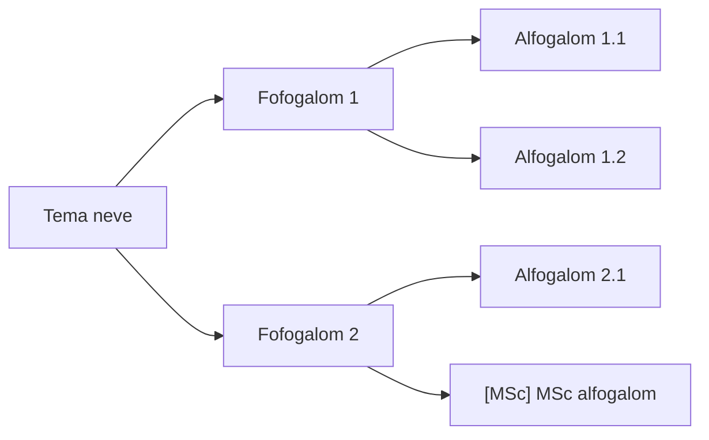

# 05_MINDMAP_MANAGER.MD -- Mindmap Manager
_05. lepes_

# 1. Cel es helye a pipeline-ban

```
00b_nlm_notebook_setup  →  05_mindmap_manager  →  01_nlm_query_runner  →  ...
```

Bemenet → `N_het/1_Mindmap.md` Mermaid `flowchart LR` formatumban.

# 2. Bemeneti forrasok (prioritas sorrendben)

## 2.1. Elsodbeleges: nlm_mindmap_raw.txt (CLI query)

A `00b_nlm_notebook_setup` lepes vegzi a mindmap generalast es a tartalmat
`nlm query notebook` paranccsal keri le:

```powershell
$env:PATH = $env:PATH + ";C:\Users\lasz\AppData\Roaming\uv\tools\notebooklm-mcp-cli\Scripts"
$NB = "<notebook_id>"

nlm query notebook $NB "Listazd a gondolatterkep teljes strukturajat: fofogalmak es minden alhivatkozasuk, hierarchikusan, kotojeles listaval. Az osszes csomopont neve jelenjen meg." --json
```

A kimenet `answer` mezeje hierarchikus bullet listakent tartalmazza a mindmap strukturajat.
Mentesi hely: `forrasok/nlm_mindmap_raw.txt`.

**Megjegyzes:** A `nlm mindmap create` letrehozza a mindmapet az NLM Studioban,
de tartalmat a CLI nem tud visszaolvasni (`nlm studio status` csak ID-t ad,
`nlm export artifact` csak Google Docs/Sheets celudat kezel). Ezert a query workaround
az elsodbeleges ut.
NOTE: magyar ékezetes betűk: `celudat`=cellát/cédulát? Vagy `elsodbeleges`=elsodbeleges

## 2.2. Masodlagos: Export-Tool MD export

Ha az Export-Tool bongeszo-bovitmeny elerheto (cced3000/NotebookLM-Export-Tool):

1. NLM Studio tab → Gondolatterkep kattyas
2. Export-Tool gomb → Markdown letoltes
3. Mentesi hely: `forrasok/nlm_mindmap_export.md`

Ez adja a legteljesebb strukturat (vizualis layout is), ezert ha elerheto, ezt hasznald.

# 3. Konverzios szabalyok (raw → Mermaid)

## 3.1. Altalanos szabalyok

- Gyoker: heti tema neve (egy node)
- Max. 3 szint melyseg (gyoker + 2 szint)
- MSc agak: `[MSc]` elotag a node neveben
- Node szovegeben kerulendo: `"`, `'`, `(`, `)`, kulonleges karakterek -- csereld `<`, `>` vagy hagyd el
- Ha a raw lista 3 szintenel melyebb: a 3. szint utan osszevonas

## 3.2. Hierarchia felterkepezese

| Raw bemenet szintje | Mermaid szint |
|:--------------------|:--------------|
| Fo pont (`- **Cim**`) | Gyoker → Foag |
| Also pont (`    - **Cim**`) | Foag → Alag |
| Masodik also pont (`        - **Cim**`) | Ha MSc: `[MSc]` elotaggal ugyanazon szinten, vagy elhagyva |

## 3.3. MSc/BSc jeloles

- Ha a raw output tartalmaz MSc jelzest, vagy az adott fogalom csak masodik/harmadik
  szintu folyoiratban jelenik meg (SCRIMP++, multidimenzios MP, stb.): `[MSc]` elotaggal.
- BSc szintu fogalmak: elotagok nelkul.
- A `05_mindmap_manager` skill nem donti el egyedul a BSc/MSc hatart --
  a `.claude/context.md` tantargy-specifikus megadasa alapjan dolgozik.

# 4. Sablon



**Kotelezo:** `flowchart LR` (nem `graph LR`, nem `mindmap`).

# 5. Kimenet

`N_het/N_Mindmap.md` -- YAML frontmatterrel, Forras szekcioval:

```markdown
---
title: N_MINDMAP.MD -- <Tema cime>
type: output
het: N
status: active
version: 1.0
updated: YYYY-MM-DD
status: DRAFT
---

# N. Mindmap -- <Tema cime>

    ```mermaid
    flowchart LR
    ...
    ```

# 2. Forras

- Generalta: `nlm query notebook <id>` (YYYY-MM-DD)
- NLM mindmap ID: `<mindmap_id>`
- Raw output: `forrasok/nlm_mindmap_raw.txt`

# Valtozasnaplo

- YYYY-MM-DD -- Letrehozva (05_mindmap_manager)
```

# 6. Kapcsolodo fajlok

| Fajl | Honnan | Felhasznalo |
|:-----|:-------|:------------|
| `forrasok/nlm_mindmap_raw.txt` | 00b (CLI query) | **05** |
| `forrasok/nlm_mindmap_export.md` | Export-Tool (ha elerheto) | **05** (masodlagos) |
| `N_het/N_Mindmap.md` | **05** | 01 (query temak meghatarozasa) |

# Valtozasnaplo

- 2026-05-22 -- Elsodbeleges bemenet: nlm_mindmap_raw.txt (CLI query workaround) dokumentalva; Export-Tool masodlagos; sablon frissitve
- 2026-05-21 -- YAML header frissitve (name typo javitva: manager_manager → manager)

# Ismert hibák

Nincs ismert, skill-specifikus pitfall. Általános: [pitfalls.md](../pitfalls.md)

# Változásjegyzék

| Dátum | Verzió | Leírás |
|-------|--------|--------|
