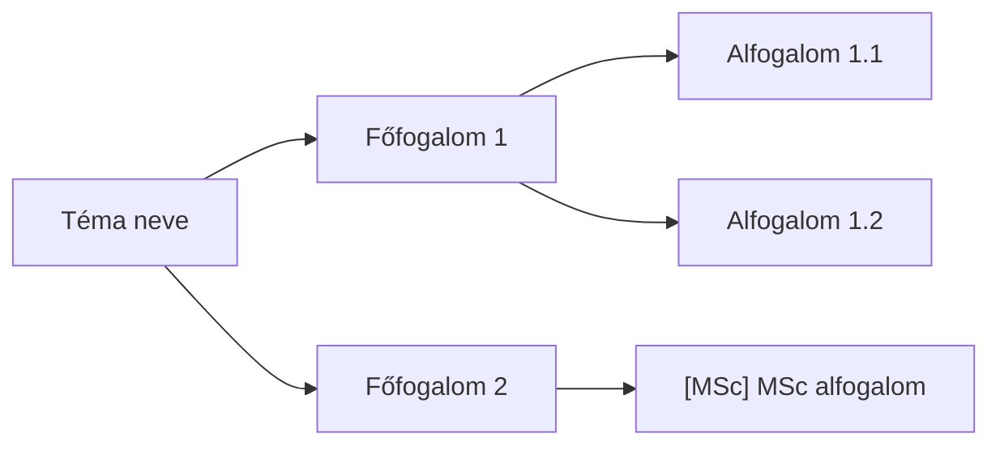

# 08_MINDMAP_MANAGER

## 1. Cél

Az NLM Studio Gondolattérkép exportjából `4_wip_outputs/N_Mindmap.md` Mermaid `flowchart LR` formátumban generálása. Ez adja a 04_nlm_query_runner query-struktúráját.

## 2. Bemenetek

**Elsődleges (preferált):**
- `3_raw_outputs/nlm_mindmap_export.md` -- 😎 Ultra Explorer bővítmény exportja

**Másodlagos (ha a bővítmény nem elérhető):**
- `3_raw_outputs/nlm_mindmap_raw.txt` -- CLI query workaround (szöveges rekonstrukció)

## 3. Eljárás

### 3.1. Ultra Explorer export (elsődleges)

1. Navigálj a notebook URL-re
2. Studio > Gondolattérkép
3. **Export** gomb (jobb felső sarok)
4. **"Expand All Nodes (Recommended)"** kattintás (sárga lakat ikon)
5. **Markdown** formátum kiválasztása
6. Letöltés → másolás: `3_raw_outputs/nlm_mindmap_export.md`

Cleanup: `, N gyermek` suffix eltávolítása minden csomópontnév után.

### 3.2. CLI workaround (másodlagos)

```powershell
$env:PATH = $env:PATH + ";C:\Users\lasz\AppData\Roaming\uv\tools\notebooklm-mcp-cli\Scripts"
nlm query notebook $NB "Listazd a gondolatterkep teljes strukturajat: fofogalmak es minden alhivatkozasuk, hierarchikusan, kotojeles listaval." --json
```

A kimenet `answer` mezője → mentés `3_raw_outputs/nlm_mindmap_raw.txt`-be.

⚠️ **Korlát:** A CLI csak szöveges rekonstrukciót ad -- nem a Studio vizuális gráfját. Lekérdezési alapként kevésbé megbízható.

### 3.3. Konverziós szabályok (raw → Mermaid)

- Gyökér: heti téma neve (egy node)
- Max. 3 szint mélység (gyökér + 2 szint)
- MSc ágak: `[MSc]` előtag a node nevében
- Node szövegében kerülendő: `"`, `'`, `(`, `)` -- csereld `<`, `>` vagy hagyd el
- Ha a raw lista 3 szintnél mélyebb: 3. szint után összevonás

| Raw szint | Mermaid szint |
|:----------|:--------------|
| Fő pont (`- **Cím**`) | Gyökér → Főág |
| Alsó pont (4 szóköz) | Főág → Alag |
| Második alsó (8 szóköz) | `[MSc]` előtaggal vagy elhagyva |

### 3.4. Mermaid sablon



**Kötelező:** `flowchart LR` (nem `graph LR`, nem `mindmap`).

## 4. Kimenetek

`4_wip_outputs/N_Mindmap.md` -- YAML frontmatterrel:

```markdown
---
title: N_MINDMAP.MD -- <Téma>
type: output
het: N
status: DRAFT
mindmap_source: ultra_explorer   # vagy: vision_bypass (ha az Ultra Explorer nem volt elérhető)
---

# N. Mindmap -- <Téma>

    ```mermaid
    flowchart LR
    ...
    ```

# 2. Forrás

- Forrás: `3_raw_outputs/nlm_mindmap_export.md` (Ultra Explorer export, YYYY-MM-DD)
- Cleanup: `, N gyermek` suffix eltávolítva
```

## 5. Ellenőrzés

- [ ] `nlm_mindmap_export.md` létezik, közvetlenül `## <Témacím>` sorral kezdődik (NEM `#` fejléc-kommenttel — a parser L0 root-ként értelmezi!)
- [ ] **Vision bypass esetén (Ultra Explorer nem elérhető):**
  - [ ] `N_Mindmap.md` frontmatterben `mindmap_source: vision_bypass` mező beállítva
  - [ ] Az `nlm_mindmap_export.md` elején ⚠️ `<!-- vision_bypass: minden csomópontot manuálisan ellenőrizz! -->` blokk elhelyezve
  - [ ] 😎 User manuálisan egyeztette az összes node-ot a Studio vizuális gráfjával (hallucináció-kockázat!)
- [ ] Csomópontok ellenőrzöttek — `(?)` jelölések javítva (`04_nlm_dfs_queries.py strip_meta()` automatikusan eltávolítja, de ajánlott manuálisan is javítani)
- [ ] 😎 **MSc jelölés:** az MSc-szintű ágak `[MSc]` előtaggal megjelölve az `nlm_mindmap_export.md`-ben (pl. `- [MSc] Kvantum-szintű megközelítés`). Szülő-öröklés manuális: ha egy L1 ág `[MSc]`, minden gyereke is az.
- [ ] **`(?)` markerek:** vision bypass esetén a bizonytalan csomópontok `(?)` jelölésüket a `04_nlm_dfs_queries.py` `strip_meta()` automatikusan eltávolítja — de ajánlott manuálisan is javítani/törölni a valóban ismeretlen node-okat.
- [ ] 😎 **Mindmap módosítás (opcionális):** ágak átnevezhetők, törölhetők, hozzáadhatók — a 04 DFS ezt a fájlt olvassa, tehát a módosítás a query-struktúrát is befolyásolja.
- [ ] `N_Mindmap.md` létezik, `flowchart LR` szintaxis helyes
- [ ] Gyökér-csomópont megfelel a heti témának
- [ ] Mermaid renderelhető (VSCode előnézet)

## 6. Hibakezelés

- Tünet: Mermaid szintaxishiba (speciális karakterek)
- Gyökérok: node nevében `"` vagy `(` karakter
- Megoldás: cseréld `<`/`>` karakterekre vagy hagyd el

## 7. Hivatkozások

- [pipeline.md](../pipeline.md)
- [04_nlm_query_runner.md](04_nlm_query_runner.md) -- a mindmap felhasználója

## 8. Visszajelzések

- 💬 NOTE: MSc jelölés (K3 után): `04_nlm_dfs_queries.py` az `[MSc]` prefixet leveszi a query-szövegből, de `dfs_node_list.json`-ban `is_msc: true` mezőt tárolja. Az `05_assemble.py` `<!-- MSc -->` blokkba csomagolja az MSc szekciókat. Szülő-öröklés: ha csak a szülő jelölt, a gyerekek NEM automatikusan MSc -- a user manuálisan jelöli az összes érintett node-ot.
- 💬 NOTE: `, N gyermek` suffix cleanup: az Ultra Explorer export minden szülő-node után `, N gyermek` szöveget illeszt be. `04_nlm_dfs_queries.py strip_meta()` automatikusan eltávolítja.
- 💬 NOTE: Az NLM Studio Gondolattérkép angolul generálódhat, ha a forrásszövegek angolok. Megvizsgálandó: van-e mód a mindmap generálás nyelvének befolyásolására Prompt B-n keresztül.
- ❔ QUESTION: Az Ultra Explorer bővítmény export automatizálható-e Claude in Chrome MCP-vel? (navigate → Export gomb → click → Markdown).

## 9. Változásjegyzék

| Dátum | Verzió | Leírás |
|-------|--------|--------|
| 2026-05-31 | 2.2 | D rész: vision bypass kötelező frontmatter (mindmap_source) + §5 ellenőrzőlista bővítve |
| 2026-05-30 | 2.1 | K0 cleanup: 2 ⚠️ (vision bypass) → §5 ellenőrzőlista; mindmap fájlnév + elhelyezés lezárva; ✅ → §9 |
| 2026-05-26 | 2.0 | Overhaul: template-alapú átírás; duplikált szekciók eltávolítva; §8 Visszajelzések |
| 2026-05-26 | 1.2 | §2 prioritás megfordítva: Ultra Explorer elsődleges; mappanév konvenció |
| 2026-05-22 | 1.1 | CLI workaround dokumentálva |
| 2026-05-21 | 1.0 | Létrehozva |
