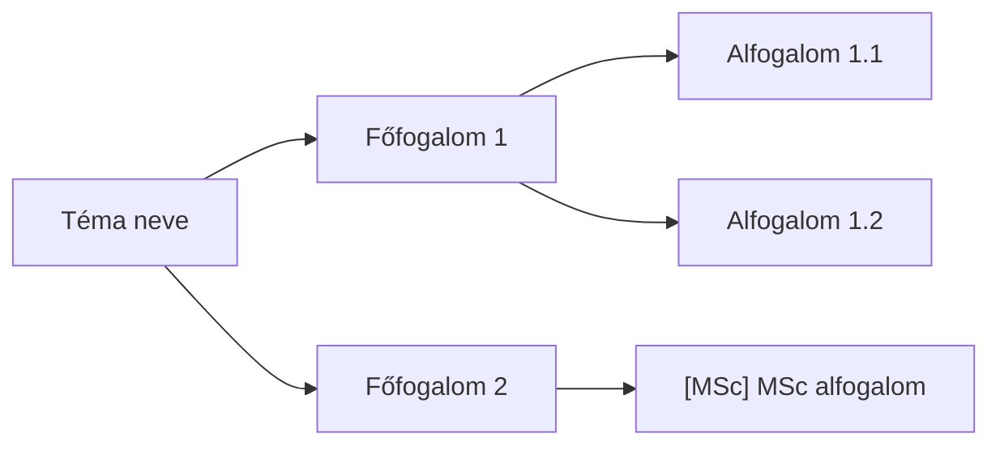

# 08_MINDMAP_MANAGER

## 1. Cél

Az NLM Studio Gondolattérkép exportjából `4_wip_outputs/N_Mindmap.md` Mermaid `flowchart LR` formátumban generálása. Ez adja a 04_nlm_query_runner query-struktúráját.

## 2. Bemenetek

**Elsődleges (preferált):**
- `3_raw_outputs/nlm_mindmap_export.md` -- 😎 Ultra Explorer bővítmény exportja

**Másodlagos (ha a bővítmény nem elérhető):**
- `3_raw_outputs/nlm_mindmap_raw.txt` -- CLI query workaround (szöveges rekonstrukció)

## 3. Eljárás

### 3.1. Ultra Explorer export (elsődleges)

1. Navigálj a notebook URL-re
2. Studio > Gondolattérkép
3. **Export** gomb (jobb felső sarok)
4. **"Expand All Nodes (Recommended)"** kattintás (sárga lakat ikon)
5. **Markdown** formátum kiválasztása
6. Letöltés → másolás: `3_raw_outputs/nlm_mindmap_export.md`

Cleanup: `, N gyermek` suffix eltávolítása minden csomópontnév után.

### 3.2. CLI workaround (másodlagos)

```powershell
$env:PATH = $env:PATH + ";C:\Users\lasz\AppData\Roaming\uv\tools\notebooklm-mcp-cli\Scripts"
nlm query notebook $NB "Listazd a gondolatterkep teljes strukturajat: fofogalmak es minden alhivatkozasuk, hierarchikusan, kotojeles listaval." --json
```

A kimenet `answer` mezője → mentés `3_raw_outputs/nlm_mindmap_raw.txt`-be.

⚠️ **Korlát:** A CLI csak szöveges rekonstrukciót ad -- nem a Studio vizuális gráfját. Lekérdezési alapként kevésbé megbízható.

⛔ **Tesztelve (2026-05-31, mini2):** A CLI workaround kimenete **NEM parse_mindmap()-kompatibilis**. A `nlm query "Listazd a gondolatterkep..."` tartalmi rekonstrukciót ad (5 főtéma, bekezdéses formátum), nem a Studio vizuális gráf-hierarchiáját. Az `[MSc]` jelölések hiányoznak, a csomópontok száma és struktúrája eltér. **A 08-as lépés manuális marad.**

### 3.3. Konverziós szabályok (raw → Mermaid)

- Gyökér: heti téma neve (egy node)
- Max. 3 szint mélység (gyökér + 2 szint)
- MSc ágak: `[MSc]` előtag a node nevében
- Node szövegében kerülendő: `"`, `'`, `(`, `)` -- csereld `<`, `>` vagy hagyd el
- Ha a raw lista 3 szintnél mélyebb: 3. szint után összevonás

| Raw szint | Mermaid szint |
|:----------|:--------------|
| Fő pont (`- **Cím**`) | Gyökér → Főág |
| Alsó pont (4 szóköz) | Főág → Alag |
| Második alsó (8 szóköz) | `[MSc]` előtaggal vagy elhagyva |

### 3.4. Mermaid sablon



**Kötelező:** `flowchart LR` (nem `graph LR`, nem `mindmap`).

## 4. Kimenetek

`4_wip_outputs/N_Mindmap.md` -- YAML frontmatterrel:

```markdown
---
title: N_MINDMAP.MD -- <Téma>
type: output
het: N
status: DRAFT
---

# N. Mindmap -- <Téma>

    ```mermaid
    flowchart LR
    ...
    ```

# 2. Forrás

- Forrás: `3_raw_outputs/nlm_mindmap_export.md` (Ultra Explorer export, YYYY-MM-DD)
- Cleanup: `, N gyermek` suffix eltávolítva
```

## 5. Ellenőrzés

- [ ] `nlm_mindmap_export.md` létezik és csomópontjai ellenőrzöttek (vision bypass esetén `(?)` jelölések javítva)
- [ ] 😎 **MSc jelölés:** az MSc-szintű ágak `[MSc]` előtaggal megjelölve az `nlm_mindmap_export.md`-ben (pl. `- [MSc] Kvantum-szintű megközelítés`). Szülő-öröklés manuális: ha egy L1 ág `[MSc]`, minden gyereke is az.
- [ ] **`(?)` markerek:** vision bypass esetén a bizonytalan csomópontok `(?)` jelölésüket a `04_nlm_dfs_queries.py` `strip_meta()` automatikusan eltávolítja — de ajánlott manuálisan is javítani/törölni a valóban ismeretlen node-okat.
- [ ] 😎 **Mindmap módosítás (opcionális):** ágak átnevezhetők, törölhetők, hozzáadhatók — a 04 DFS ezt a fájlt olvassa, tehát a módosítás a query-struktúrát is befolyásolja.
- [ ] `N_Mindmap.md` létezik, `flowchart LR` szintaxis helyes
- [ ] Gyökér-csomópont megfelel a heti témának
- [ ] Mermaid renderelhető (VSCode előnézet)

## 6. Hibakezelés

- Tünet: Mermaid szintaxishiba (speciális karakterek)
- Gyökérok: node nevében `"` vagy `(` karakter
- Megoldás: cseréld `<`/`>` karakterekre vagy hagyd el

## 7. Hivatkozások

- [pipeline.md](../pipeline.md)
- [04_nlm_query_runner.md](04_nlm_query_runner.md) -- a mindmap felhasználója

## 8. Visszajelzések

- ⚠️ **Vision bypass fájl NE tartalmazzon `#` fejléc-kommenteket (tesztelve 2026-05-30, mini2).** A `04_nlm_dfs_queries.py` parser minden `#`-os sort L0 root-node-ként értelmez -- ha a fájl metaadat-fejléccel kezdődik (pl. `# NLM Mindmap Export...`, `# Forrás:...`), ezek bekerülnek a DFS query-kbe. Fix: a `nlm_mindmap_export.md` **közvetlenül** a `## <Témacím>` sorral kezdődjön, semmi más előtte.
- ⚠️ **Vision bypass = erős LLM-hallucináció-gyanú (tesztelve 2026-05-30, mini2).** A Claude a PNG-ből rekonstruált csomópontokat részben kitalálta -- a kisebb szövegű node-ok tartalma nem olvasható megbízhatóan, és az LLM az ismerős témából pótolta a hiányzó részeket. Következmény: a rekonstruált `nlm_mindmap_export.md` akár teljesen fiktív ágakat is tartalmazhat. **A vision bypass csak végsős fallback** -- az Ultra Explorer `.md` export az egyetlen megbízható forrás. Ha PNG az egyetlen elérhető export, a user köteles manuálisan felülvizsgálni minden csomópontot a NLM Studio vizuális gráfjával összevetve. (Korábbi dokumentáció: mini teszt 2026-05-28 -- ott is ez a korlát érvényes volt.)
- 🔲 TODO: **MSc jelölés -- szülő-öröklés tesztelendő (mini2, 2026-05-30).** A user szándékosan vegyes jelölést alkalmazott: szülő, gyerek és unoka node-okon is van `[MSc]` előtag (nem csak szülőkön). Tesztelendő a 04 DFS futása után: (1) örökli-e a `04_nlm_dfs_queries.py` a flagjet a leszármazottakra ha csak a szülő jelölt? (2) mi történik ha csak a gyerek/unoka jelölt, a szülő nem? Elvárt viselkedés: szülő `[MSc]` → minden leszármazott automatikusan MSc. Jelenlegi workaround: a user manuálisan jelöl minden érintett csomópontot.
- ✅ **MSc jelölés és mindmap-módosítás beépítve a §5 ellenőrzőlistába és a pipeline.md §4 checkpoint szövegébe.** (2026-05-30)
- 🔲 TODO: A mindmap export fájlneve NLM-generált (pl. `"A Diszkrét Fourier-transzformáció és az FFT Algori.md"`), nem a várt `nlm_mindmap_export.md`. A `04_nlm_dfs_queries.py` sor 171 hardcode-olt `nlm_mindmap_export.md` nevet vár. A 08. lépés skill §3.1 nem tartalmaz explicit instrukciókat arra, hogy a user hogyan nevezze át a letöltött fájlt. Szükséges: 😎 manuális átnevezés a mentés után, vagy a 04 script kezelje a tényleges fájlnevet.
- 💬 NOTE: `, N gyermek` suffix cleanup: az Ultra Explorer export minden szülő-node után `, N gyermek` szöveget illeszt be. Ezt eltávolítani kell a Mermaid konverzió előtt.
- 💬 NOTE: Az NLM Studio Gondolattérkép angol nyelvű (az NLM az angol forrásszövegek alapján generálja), holott a tananyag magyar. Ez nyelvi inkonzisztenciát okoz: a mindmap csomópontok angol terminológiával épülnek fel. Megvizsgálandó: van-e mód a mindmap generálás nyelvének befolyásolására Prompt B-n keresztül.
- 🔲 TODO: **Mindmap elhelyezése `4_wip_outputs/`-ban (tesztelve 2026-05-27).** A `nlm_mindmap_export.md` jelenleg `3_raw_outputs/`-ban marad nyers inputként; a 08. lépés belőle `4_wip_outputs/N_Mindmap.md`-t generál. A teljes mindmap (BSc + MSc ágakkal együtt) egyszer kerül feldolgozásra -- a DFS is egyszer fut rajta végig. Az `[MSc]` flag szerinti szétválasztás nem a mindmapnél, hanem a derivált dokumentumoknál (`N_Mindmap.md`, `N_Jegyzet.md`, `N_Prezentacio.md` stb.) történik: a 14_bsc_filter ezekből szűri ki az MSc tartalmakat. Megvizsgálandó: a `4_wip_outputs/N_Mindmap.md` tartalmazza-e az `[MSc]` tageket (hogy a 14_bsc_filter hivatkozni tudjon rájuk), vagy a tag csak a `nlm_mindmap_export.md`-ben marad.
- ❔ QUESTION: Az Ultra Explorer bővítmény export automatizálható-e Claude in Chrome MCP-vel? (navigate → find Export gomb → click → Markdown). Jelenlegi státusz: ❔ tesztelendő.

## 9. Változásjegyzék

| Dátum | Verzió | Leírás |
|-------|--------|--------|
| 2026-05-26 | 2.0 | Overhaul: template-alapú átírás; duplikált szekciók eltávolítva; §8 Visszajelzések |
| 2026-05-26 | 1.2 | §2 prioritás megfordítva: Ultra Explorer elsődleges; mappanév konvenció |
| 2026-05-22 | 1.1 | CLI workaround dokumentálva |
| 2026-05-21 | 1.0 | Létrehozva |
