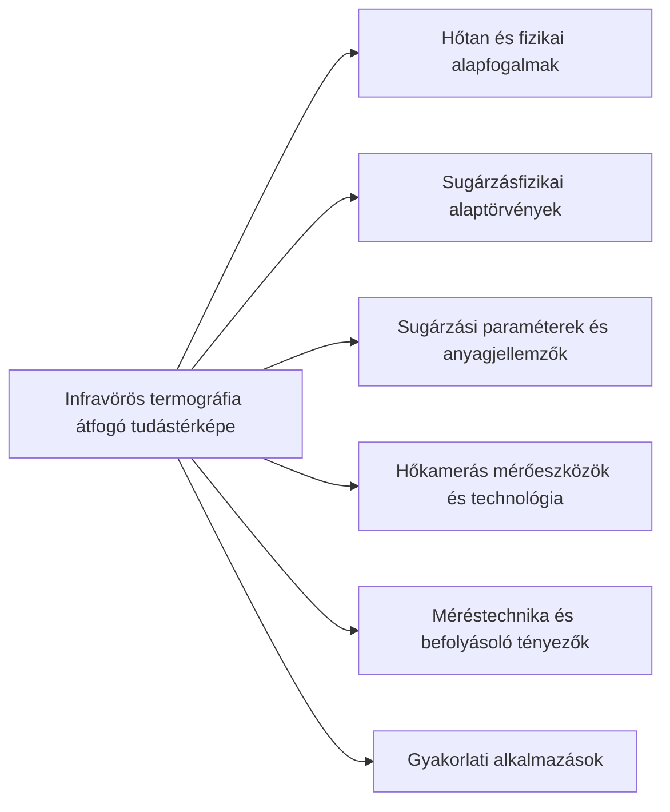

# 1_Mindmap -- Infravörös Termográfia

_Forrás: NLM Gondolattérkép (ID: bf292b0c)_

# Csomópontok

| # | Szint | Csomópont |
|:--|:------|:----------|
| 0 | Level 1 | Infravörös termográfia átfogó tudástérképe |
| 1 | Level 2 | Hőtan és fizikai alapfogalmak |
| 2 | Level 2 | Sugárzásfizikai alaptörvények |
| 3 | Level 2 | Sugárzási paraméterek és anyagjellemzők |
| 4 | Level 2 | Hőkamerás mérőeszközök és technológia |
| 5 | Level 2 | Méréstechnika és befolyásoló tényezők |
| 6 | Level 2 | Gyakorlati alkalmazások |
