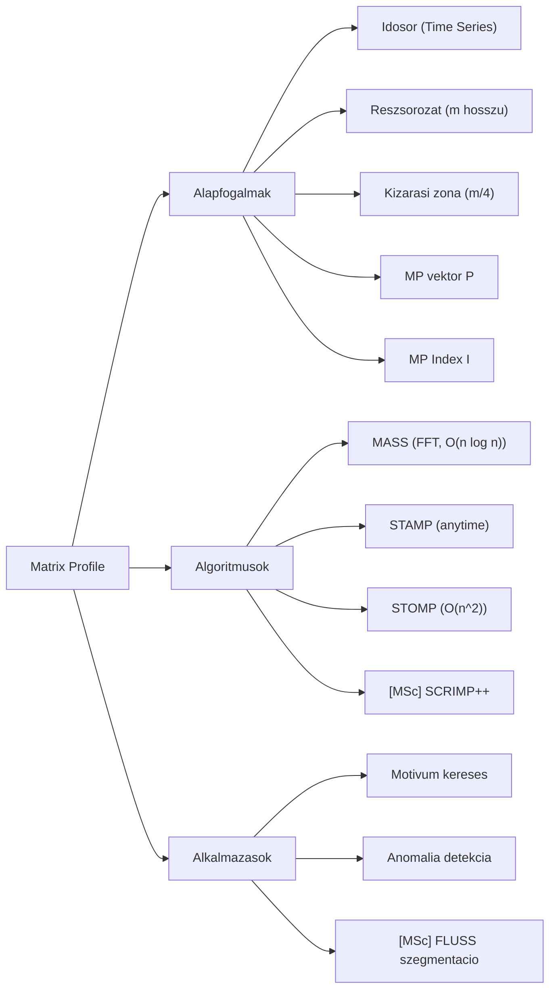

# 1. Mindmap -- Matrix Profile

# 2. Forras

- Generalta: `nlm chat` szimulacio (2026-05-23)
- Notebook: 6d6525ba-4804-4d78-b771-9bf1278e85e9
- Raw: `clean_sources/nlm_q1_raw.txt`

# Valtozasnaplo

- 2026-05-23 -- [SIM] Letrehozva (05_mindmap_manager szimulacio)
