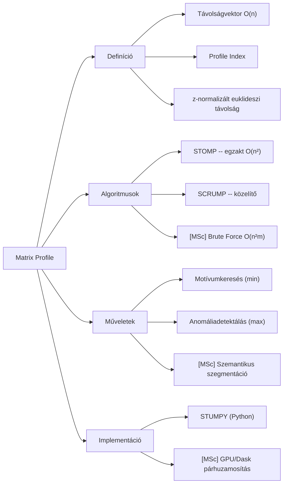

# 1. Mindmap -- Matrix Profile

## Forrás

- Generálta: `nlm_query.py` (2026-05-24)
- Notebook: 013ea69e-ee02-4a13-9389-7f46d7fb37ae
- Raw: `clean_sources/nlm_q1_raw.txt`

# Változásnapló

- 2026-05-24 -- 1.1: Újragenerálva -- ékezetek javítva (05_mindmap_manager)
