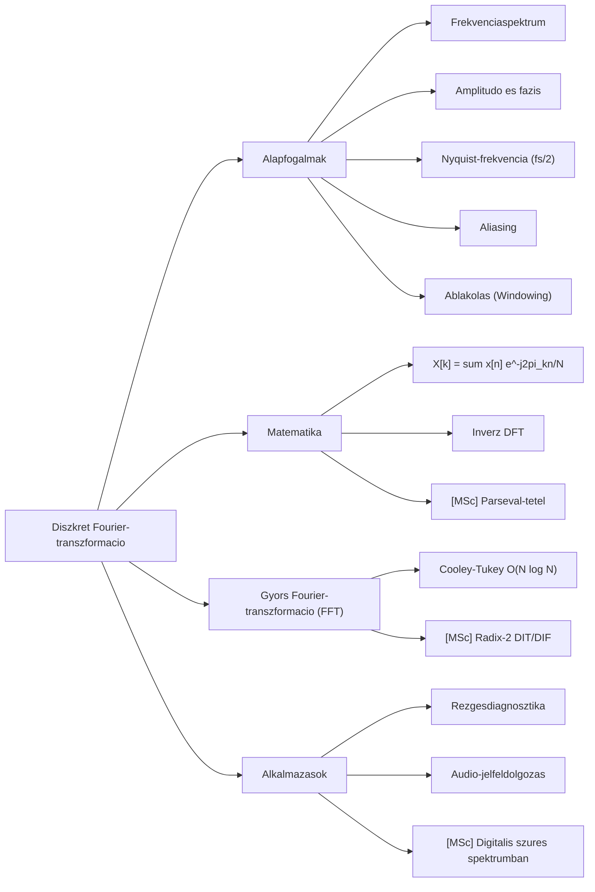

# 2. Mindmap -- Diszkret Fourier-transzformacio

# 2. Forras

- Generalta: `nlm chat` szimulacio (2026-05-23)
- Notebook: 231a232e-6620-41a0-b30b-03a8a6c187b8
- Raw: `clean_sources/nlm_q1_raw.txt`

# Valtozasnaplo

- 2026-05-23 -- [SIM] Letrehozva (05_mindmap_manager szimulacio)
