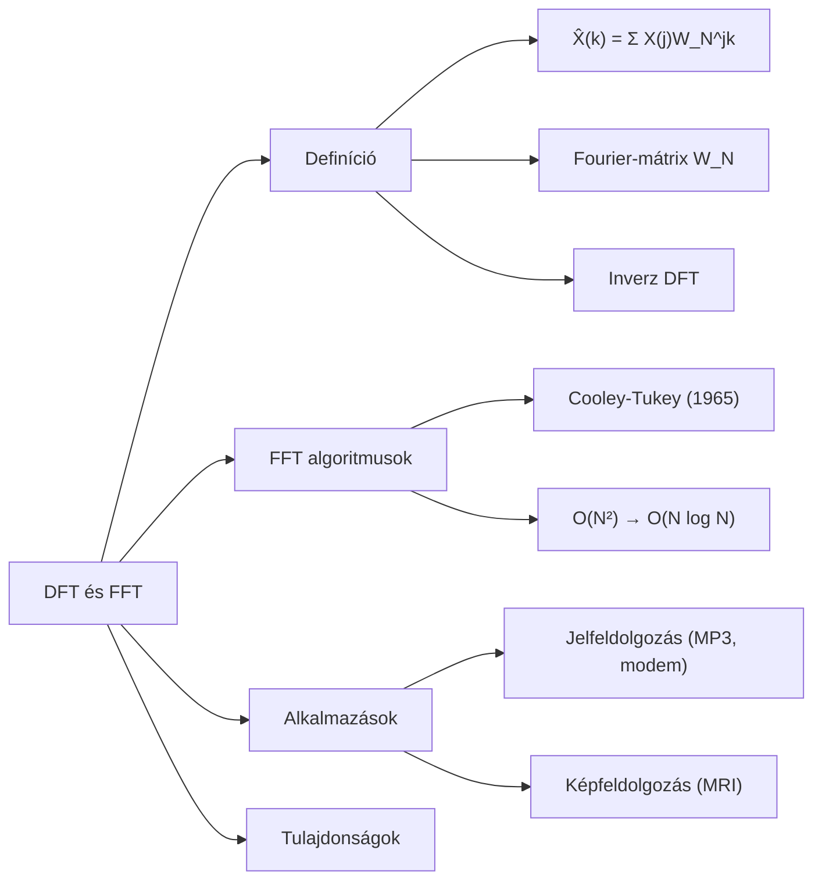

# 2. Mindmap -- DFT és FFT

## Forrás

- Generálta: `nlm_query.py` (2026-05-24)
- Notebook: 9447f8a8-d261-4522-8cc6-862befe1aabe
- Raw: `clean_sources/nlm_q1_raw.txt`

# Változásnapló

- 2026-05-24 -- 1.1: Újragenerálva -- ékezetek javítva (05_mindmap_manager)
