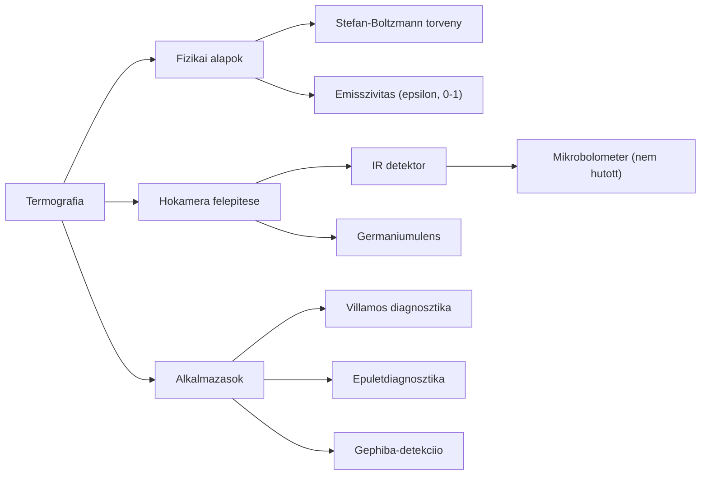

# 3. Mindmap -- Termografia

# 2. Forras

- Generalta: `nlm chat` szimulacio (2026-05-23)
- Notebook: 21de071f-0bf0-4c31-b4c2-e24f9d6d542a
- Raw: `clean_sources/nlm_q1_raw.txt`

# Valtozasnaplo

- 2026-05-23 -- [SIM] Letrehozva (05_mindmap_manager szimulacio)
