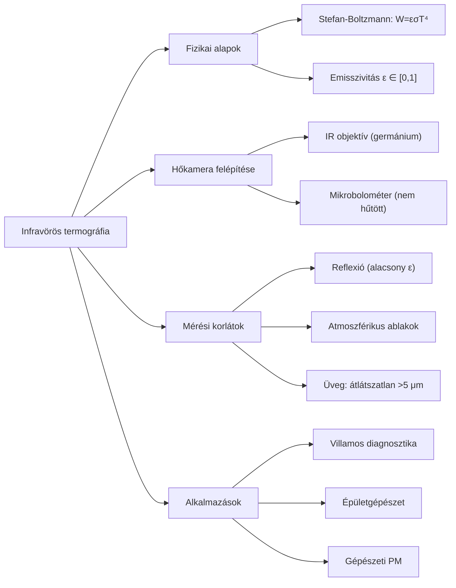

# 3. Mindmap -- Infravörös termográfia

## Forrás

- Generálta: `nlm_query.py` (2026-05-24)
- Notebook: 2af3a356-2a36-47f1-8adc-1da4bc44de72
- Raw: `clean_sources/nlm_q1_raw.txt`

# Változásnapló

- 2026-05-24 -- 1.1: Újragenerálva -- ékezetek javítva (05_mindmap_manager)
