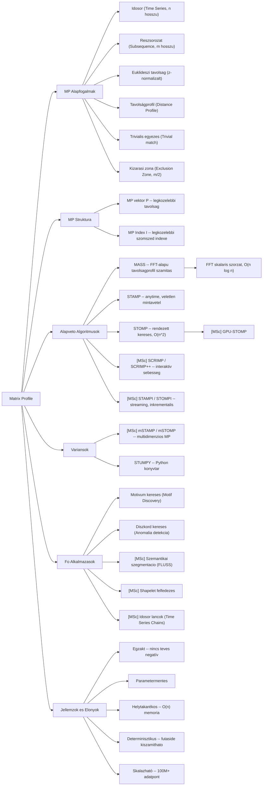

# 1. Mindmap -- Matrix Profile: Alapok es Alkalmazasok

# 2. Forras

- Generalta: `nlm query notebook ff49ac69-0750-4773-bd4d-42536e96be3f` (2026-05-22)
- NLM mindmap ID: `d74b759b-81dc-432d-9229-ccc13331ff89`
- Raw output: `forrasok/nlm_mindmap_raw.txt`

# Valtozasnaplo

- 2026-05-22 -- Letrehozva (05_mindmap_manager, NLM CLI query alapjan)
